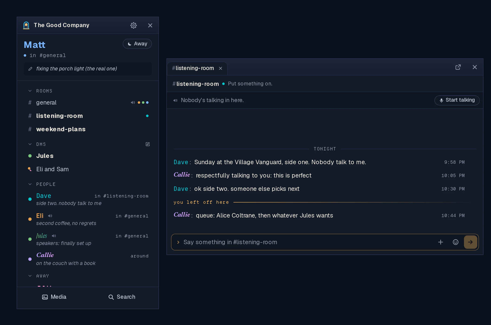

<div align="center">

</div>

# Linger

**A small, self-hosted place for a group of friends to hang out.**

One person runs a server; their friends install the app and connect to it.
Text rooms, voice rooms, DMs, file sharing, and a buddy list that shows who's
around. Not federated, not a platform, no company in the middle. Built for a
dinner party of eight, not a stadium of fifty thousand strangers.

<div align="center">

</div>

**Status: 0.4.2, testing with friends.** It works day to day; voice across
different networks and some desktop setups still need checks on real
computers. [SPEC.md](SPEC.md) is the full product description.

## What it does

- **The buddy list.** One tall window: you, the rooms with who's in each, your
  DMs, and everyone on the server, here, away (with their away message) or
  offline. Closing it keeps Linger running in the tray.
- **Conversations as tabs** in one chat window, or each in a window of its own.
- **No unread counts.** A room with something new gets a bolder name, and a
  conversation opens at "you left off here". Never a badge.
- **Styled names and statuses**: your own font, color, gradient and glow, and
  away messages.
- **Files and media.** 500 MB uploads, EXIF always stripped. The Media window
  keeps everything ever shared; star things to keep them forever.
- **Voice rooms** with mute, deafen, push-to-talk and per-person volume. The
  host's server can pass voice along so up to 25 can talk at once, and a relay
  the host can run helps friends on different networks.
- **Knock** to nudge one person: a soft sound and a card that fades.
- **Search** through what people said and the files they shared.
- **Several servers at once**, each a folding section of the list.
- **Full export.** Anyone can export public rooms and their own DMs, with
  files, without asking the host.
- **Linux and Windows** (Tauri 2, not Electron). macOS builds from source.

**What it will never have:** XP, streaks or engagement metrics. Federation,
bots, roles, threads, `@everyone`, algorithmic ordering, unread badges.
Telemetry or analytics of any kind. A paid tier or a store. AI features.
Anything that watches which applications you have open. The scope discipline
is the product.

## Privacy

**The person running the server can read everything on it**, and when their
server forwards voice, it passes through there too. There is no end-to-end
encryption. Traffic goes over TLS; files and the database are not
encrypted on the host's disk. Run your own server, or trust the person who
runs yours. If you need guarantees against your host, use Signal.

What *is* guaranteed: no telemetry, analytics or crash reporting, not even
opt-in (the app only contacts GitHub to check for updates); EXIF, including
GPS, stripped from every image; and no code that could read a window title
([decision](docs/decisions.md), 2026-08-28).

## Installing the app

You need an invite link from your host. The [user guide](docs/user-guide.md)
covers each step and what to do when something goes wrong.

| Your computer | How |
|---|---|
| **Windows** | The `…x64-setup.exe` from the [latest release](https://github.com/itsMattGuenther/Linger/releases/latest) |
| **Omarchy or Arch** | The one-line setup below; updates then come with your system |
| **Ubuntu, Debian, Mint** | The `…amd64.deb`: `sudo apt install ~/Downloads/Linger_<version>_amd64.deb` |
| **Fedora, openSUSE** | The `…x86_64.rpm`: `sudo dnf install` (or `zypper install`) it |
| **Any other Linux** | The `…amd64.AppImage`: `chmod +x` it, then run it |

```bash
# Omarchy and Arch: trusts Linger's signing key, adds its repository, installs
curl -fsSL https://raw.githubusercontent.com/itsMattGuenther/Linger/main/packaging/arch/setup.sh | bash
```

**Windows will warn you** ("Windows protected your PC"): choose *More info*,
then *Run anyway*. The installer isn't code-signed; that's a
[decision](docs/decisions.md), not a broken download. Updates are signed, and
the app checks the signature before installing one.

## Running a server

[The host guide](docs/host-guide.md) is the step-by-step path: a VPS or a
computer at home, Docker, DNS, voice, backups and updates.
[Creating your first VPS](docs/vps-setup.md) covers the cloud side. The short
version, for someone who already has Docker and two DNS names pointing at the
machine:

```bash
mkdir linger && cd linger
curl -fLO https://raw.githubusercontent.com/itsMattGuenther/Linger/main/deploy/compose.yaml
curl -fLO https://raw.githubusercontent.com/itsMattGuenther/Linger/main/deploy/Caddyfile
# put your two names (yours, and cdn. in front of it) in both files
docker compose run --rm --user root --entrypoint chown linger linger:linger /data
docker compose up -d
docker compose logs linger   # prints a one-time setup link
```

Paste the setup link into the app. It makes your account, makes you the host
and names the server. To update later: `docker compose pull && docker compose up -d`.

## Reporting a problem

Open an [issue](https://github.com/itsMattGuenther/Linger/issues/new/choose).
Issues are public, so leave out message text, other people's names, server
addresses and invite links. If you use a coding agent, the
[`linger-report` skill](agents/) drafts the issue with you.

## Development

```
crates/linger-core/    shared types, IDs and the palette: the wire contract
crates/linger-server/  the server: REST and WebSocket gateway, SQLite, file storage
client/                the desktop app: Tauri 2 shell (src-tauri) and React
                       (src/next is the app; the rest of src is the previous
                       client, kept for one release behind LINGER_CLASSIC=1)
deploy/                Dockerfile, compose and Caddyfile
packaging/arch/        the Arch/Omarchy package and its repository
docs/                  guides, decisions, design, release notes
scripts/               check.sh (the whole local gate) and what it calls
```

```bash
cargo test --workspace                        # server and core, no GUI needed
cd client && pnpm install && pnpm check && pnpm test
cd client && pnpm tauri dev                   # the desktop app
```

The desktop app needs a webview, ALSA headers, cmake, the GStreamer plugins
for sound, and the appindicator library for the tray; the packages for each
distribution are in [docs/development.md](docs/development.md), with
everything else about building and testing. **Run `scripts/check.sh` before
pushing**; it runs what CI runs.

Start with [CONTRIBUTING.md](CONTRIBUTING.md) and [AGENTS.md](AGENTS.md). The
docs ([SPEC](SPEC.md), [ARCHITECTURE](ARCHITECTURE.md),
[PROTOCOL](PROTOCOL.md)) are the source of truth; the queue is
[TASKS.md](TASKS.md).

## License

[AGPL-3.0](LICENSE). If you run a modified server for other people, they get
the source.
