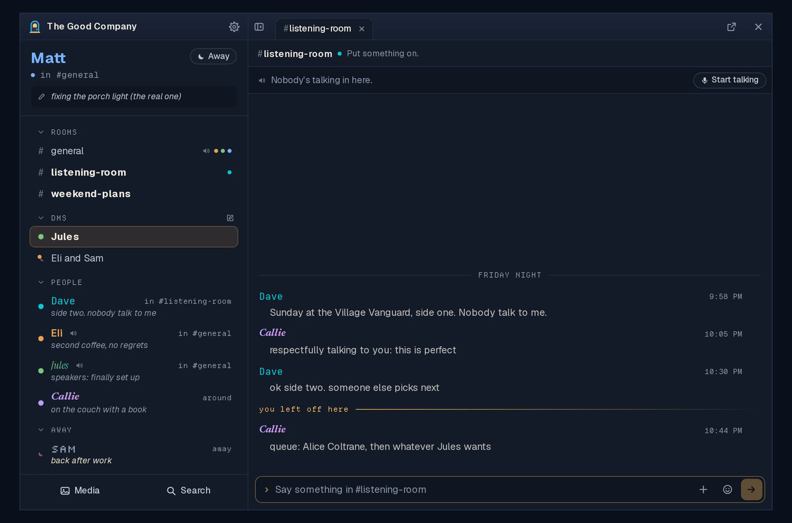

<div align="center">


<p>
<a href="https://github.com/itsMattGuenther/Linger/releases/latest"></a>
<a href="https://github.com/itsMattGuenther/Linger/actions/workflows/ci.yml?query=branch%3Amain"></a>
<a href="LICENSE"></a>
<a href="#-installing-the-app"></a>
<a href="#-running-a-server"></a>
<a href="#-privacy"></a>
<a href="docs/development.md"></a>
</p>

<p><strong><a href="https://linger-site.netlify.app">Website</a></strong> · <a href="https://github.com/itsMattGuenther/Linger/releases/latest">Download</a> · <a href="docs/user-guide.md">User guide</a> · <a href="docs/host-guide.md">Host guide</a></p>
</div>

# Linger

**A small, self-hosted place for a group of friends to hang out.**

One person runs a server; their friends install the app and connect to it.
Text rooms, voice rooms, DMs, file sharing, and a buddy list that shows who's
around. Not federated, not a platform, no company in the middle. Built for
people who already know each other, not a stadium of fifty thousand strangers.

> To linger is to stay somewhere with no agenda and no obligation to be doing
> anything. That is the product thesis in one word.

<div align="center">

</div>

**Status: 0.4.8, testing with friends.** It works day to day; voice across
different networks and some desktop setups still need checks on real
computers. [SPEC.md](SPEC.md) is the full product description.

## 🏠 The case for running your own

There was a stretch of the internet where a group of friends just *had* a place. Somebody
ran it. You knew who that was, you could ask them for things, and the whole arrangement
was a few files on a machine somebody owned. Then everyone moved into one enormous
building owned by a company, and the terms changed:

- **Your conversations sit on someone else's disk, and the company's business depends on
  what it can learn from them.**
- **Features get held back and sold back to you.** The free experience gets a little
  worse on purpose, because friction is what makes an upsell work. That is not a bug in
  the design... it *is* the design.
- **There's a storefront in the middle of your conversation**, selling cosmetics and
  subscriptions nobody asked for.
- **The product changes under you** whenever a growth target does, and nobody asks.

Linger is the other arrangement. One person runs a server for their friends. The whole
thing is one binary, one SQLite file, and a folder of uploads — you can back it up, move
it to another box, read it with off-the-shelf tools, or walk away with all of it. There
is no account that spans servers, no directory, no company in the middle.

And there is nothing to sell you, structurally: no paid tier, no store, no cosmetics, no
premium anything, and none of it held back for later. It's AGPL-3.0, so if someone runs a
modified server for other people, those people get the source. **Zero telemetry** — not
opt-in, not anonymous, not crash reports.

This is not an attempt to build a better platform. It's an attempt to not need one.

## ✨ What it does

- **The buddy list.** One tall window of places and people: you, the rooms
  with who's in each (your group DMs with them), and everyone on the server,
  here, away (with their away message) or offline. A DM lives on its person:
  their row lights up when they write, the people you're talking to stay at
  the top, and clicking someone opens them beside the list. Closing it keeps Linger running in the tray, and it can start when
  you sign in to the computer (off unless you turn it on).
- **Conversations beside the list**, as tabs in the list's own window, which
  folds back to just the list when you want it slim. Or each in a window of its own.
- **No unread counts.** A room with something new gets a bolder name, and a
  conversation opens at "you left off here". A DM you haven't read is lit in
  amber as well, with a desktop banner saying who it's from. Never a badge.
- **Styled names and statuses**: your own font, color, gradient and glow; a
  status with up to three short fields you label yourself, links included;
  and away messages.
- **Files and media.** 500 MB uploads, EXIF always stripped. Media, a tab
  beside your list, keeps everything ever shared; star things to keep them forever.
- **Voice rooms** with mute, deafen, push-to-talk and per-person volume. Voice
  goes through the host's server, which passes it on so up to 60 can talk at
  once, and a relay the host can run lets in friends whose network blocks it.
  Voice rooms are never recorded.
- **Voice messages**: record a clip in the message box, hear it back, then
  send it or throw it away. Up to five minutes.
- **Knock** to nudge one person: a soft sound and a card that fades.
- **Search** through what people said and the files they shared.
- **Several servers at once**, each a folding section of the list.
- **A co-host** for when the host is away: one switch the host gives
  somebody, so they can look after rooms, reports and people. It isn't a
  role system; there is nothing else to set.
- **Full export.** Anyone can export public rooms and their own DMs, with
  files, without asking the host.
- **Linux and Windows** (Tauri 2, not Electron). macOS builds from source.

**What it will never have:** XP, streaks or engagement metrics. Federation,
bots, roles, threads, `@everyone`, algorithmic ordering, unread badges.
Telemetry or analytics of any kind. A paid tier or a store. Anything that
watches which applications you have open. The scope discipline is the
product.

## 🔐 Privacy

**The person running the server can read everything on it**, and voice passes
through it too. There is no end-to-end
encryption. Traffic goes over TLS; files and the database are not
encrypted on the host's disk. Run your own server, or trust the person who
runs yours. If you need guarantees against your host, use Signal.

What *is* guaranteed: no telemetry, analytics or crash reporting, not even
opt-in (the app only contacts GitHub to check for updates); EXIF, including
GPS, stripped from every image; and no code that could read a window title
([decision](docs/decisions.md), 2026-08-28).

## 📦 Installing the app

You need an invite link from your host. The [user guide](docs/user-guide.md)
covers each step and what to do when something goes wrong.

| Your computer | How |
|---|---|
| **Windows** | The `…x64-setup.exe` from the [latest release](https://github.com/itsMattGuenther/Linger/releases/latest) |
| **Omarchy or Arch** | The one-line setup below; updates then come with your system |
| **Ubuntu, Debian, Mint** | The `…amd64.deb`: `sudo apt install ~/Downloads/Linger_<version>_amd64.deb` |
| **Fedora, openSUSE** | The `…x86_64.rpm`: `sudo dnf install` (or `zypper install`) it |
| **Any other Linux** | The `…amd64.AppImage`: `chmod +x` it, then run it |
| **An Android phone** | The `…android-arm64.apk`, downloaded and opened on the phone (from 0.4.8; Android asks you to allow installs from your browser) |

```bash
# Omarchy and Arch: trusts Linger's signing key, adds its repository, installs
curl -fsSL https://raw.githubusercontent.com/itsMattGuenther/Linger/main/packaging/arch/setup.sh | bash
```

**Windows will warn you** ("Windows protected your PC"): choose *More info*,
then *Run anyway*. The installer isn't code-signed; that's a
[decision](docs/decisions.md), not a broken download. Updates are signed, and
the app checks the signature before installing one.

## 🚀 Running a server

[The host guide](docs/host-guide.md) is the step-by-step path: a VPS or a
computer at home, Docker, DNS, voice, backups and updates. The server runs on
Intel or AMD (x86-64) machines only; there's no ARM build, so not a Raspberry
Pi.
[Creating your first VPS](docs/vps-setup.md) covers the cloud side. The short
version, for someone who already has Docker and two DNS names pointing at the
machine:

```bash
mkdir linger && cd linger
curl -fLO https://raw.githubusercontent.com/itsMattGuenther/Linger/main/deploy/setup.sh
bash setup.sh   # asks for your name, checks it, starts the server, prints a setup link
```

The script fetches the server's files, writes your settings into `.env` (the
one file you'd ever edit), opens the firewall ports and prints a one-time setup
link. Paste that link into the app. It makes your account, makes you the host
and names the server. Voice needs UDP 3479 open, and nothing else. To update later, run `./update.sh` in the same folder: it
backs up the database, updates and restarts, and prints the version it's on.

## 🐞 Reporting a problem

Open an [issue](https://github.com/itsMattGuenther/Linger/issues/new/choose).
Issues are public, so leave out message text, other people's names, server
addresses and invite links. If you use a coding agent, the
[`linger-report` skill](agents/) drafts the issue with you.

## 🛠️ Development

```
crates/linger-core/    shared types, IDs and the palette: the wire contract
crates/linger-server/  the server: REST and WebSocket gateway, SQLite, file storage
client/                the desktop app: Tauri 2 shell (src-tauri) and React
                       (src/next is the app; src/lib is the logic its windows
                       share, and src/generated the wire types); the phone
                       app, started, builds from the same shell
                       (src-tauri/gen/android)
deploy/                Dockerfile, compose, Caddyfile, .env.example, setup.sh, update.sh
packaging/arch/        the Arch/Omarchy package and its repository
docs/                  guides, decisions, design, release notes
scripts/               check.sh (the local gate) and what it calls
```

```bash
cargo test --workspace                        # server and core, no GUI needed
cd client && pnpm install && pnpm check && pnpm test
cd client && pnpm tauri dev                   # the desktop app
cd client && pnpm tauri android dev           # the phone app, on Android
```

The desktop app needs a webview, ALSA headers, cmake, the GStreamer plugins
for sound, and the appindicator library for the tray; the packages for each
distribution are in [docs/development.md](docs/development.md), with
everything else about building and testing. The phone app needs Android
Studio, Java 21 and the Rust Android targets; the steps are in its section
there. **Run `scripts/check.sh` before
pushing**; it runs what CI runs for your change, and
[docs/testing-strategy.md](docs/testing-strategy.md) says what runs where.

Start with [CONTRIBUTING.md](CONTRIBUTING.md) and [AGENTS.md](AGENTS.md). The
docs ([SPEC](SPEC.md), [ARCHITECTURE](ARCHITECTURE.md),
[PROTOCOL](PROTOCOL.md)) are the source of truth; the queue is
[TASKS.md](TASKS.md).

## 📜 License

[AGPL-3.0](LICENSE). If you run a modified server for other people, they get
the source.
