# The Buddy list design

**Status: chosen, not built.** On 2026-09-25 Matt picked this as the design
Linger will move to. It is parked on the `design/buddy-list` branch until the
build starts. Nothing here is in the app, and the app still follows SPEC §5
("Console") until this design replaces it.

It came out of #101's design exploration. Seven other directions were tried and
dropped. This page and the prototype in `client/prototypes/` are what is left.

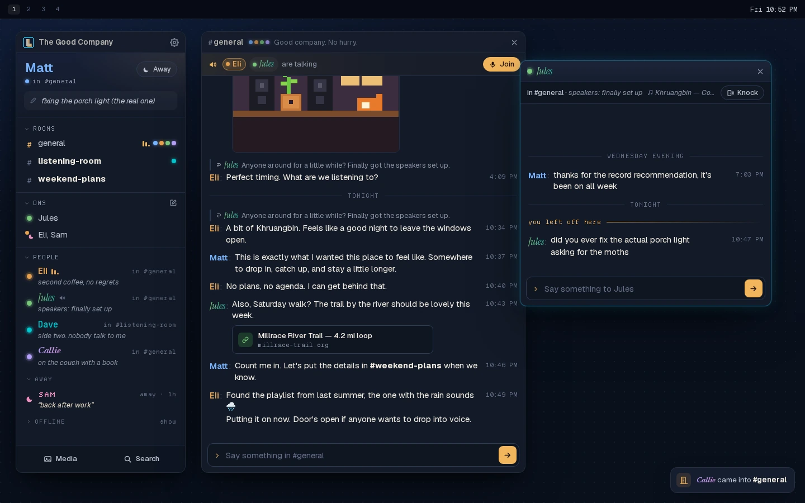

## Agreed on 2026-09-25

- **Keep the prototype's look and feel exactly:** the colors, type and spacing,
  and how fast and snappy it feels.
- **The buddy list is the app.** It is Linger's own window, not a page in a
  browser. Conversations are real windows, or tabs in one.
- **Linger draws its own title bars in every window,** so the look is the same
  everywhere. The operating system still moves, snaps, resizes and tiles them.
- **Tabs are the default everywhere, Hyprland included.** The first room you
  open gets a chat window, which Hyprland tiles beside your list. The rooms you
  open after that join it as tabs. Any tab can be popped out into its own
  window. "Each in its own window" is a setting you turn on.
- **Linux and Windows first.** No Mac version for now.
- **No avatars.** Nobody has a picture, you included. Identity is the styled
  name and the colored dot.

## The idea

Eight friends don't need Discord's four columns; they need a buddy list. The
spec already calls name styling "the AIM feature" and the status "the AIM away
message". This goes all the way: the main window is a tall list of your
friends, and conversations open beside it.

It fits either way of working. Keep it minimal, with one slim list at the edge
of the screen, or fill the screen with rooms side by side.

## Try the prototype

```sh
git switch design/buddy-list
cd client
pnpm exec vite --port 1421
```

Open <http://localhost:1421/prototypes/buddy-list/>. The prototype is plain
HTML and JavaScript. Nothing talks to a server. It is alive, though: friends
arrive, type and talk in voice, and if you send a message somebody answers.

Add these to the address to change how it starts:

| Address | What it shows |
|---|---|
| `?tabs` | conversations as tabs in one window |
| `?servers` | the list for somebody on three servers |
| `?tabs&servers` | both |
| `?mark=l`, `dots`, `lamp`, `word` | the placeholder small-logo options (below) |
| `?still` | one frozen moment, for screenshots |

The gear at the top of the list opens Settings (Ctrl+, does too). The bar
across the top of the page stands in for your desktop's own bar, such as
Waybar. Its dashed group holds the prototype-only controls: one server or
three, and Tile.

## The look

It takes its colors from the logo, a lamp-lit porch at night:

- **Surfaces:** night blue.
- **Lamp amber:** for the few things that matter, such as the primary action
  and "you left off here".
- **Cyan:** a faint outline on the focused window, like the logo's sign.
- **Labels:** Departure Mono.
- **Message text:** always a plain sans.

People show a marker in their own palette color, next to their name in its
own styling. There's one marker per state, all the same size:

- **here:** a solid dot;
- **away:** a small crescent moon;
- **offline:** the dot, dimmed.

The words ("away", "last here yesterday") are in the row and in tooltips and
screen-reader labels, so nothing relies on the shape or the color alone.

Every row in the list shares one marker column: a room's `#`, a DM's people,
a person's marker. So names line up down the whole list. A group DM's people
share that column too, arranged inside it. Rows have a fixed line height, so a
name set in a big serif or a small pixel face never changes the spacing.

**The small mark is a placeholder.** The porch picture could not be read at the
16–20px it gets beside the server name, so four pixel-drawn options were tried:

- a pixel "L" on the logo's night panel, with a cyan border (the default);
- the logo's three dots;
- the porch lamp;
- the word "Linger" in the logo's pixel face.

Matt didn't like any of them (2026-09-25), and the small logo gets redesigned
later. The "L" stays in as a stand-in, and `?mark=` still switches between the
four.

## The buddy list

From top to bottom, for each server:

1. **You:** your styled name, where you are, your status (click to edit), and an
   **Away** button. It opens an AIM-style away-message editor with saved
   presets. There is no picture.
2. **Rooms,** right under you, because they're where the activity shows:
   - the room's name, bold when something new arrives (weight only, no number);
   - the dots of who's in it;
   - moving sound bars while voice is on.

   Click a room to open it.
3. **DMs,** with a **new message** button on the heading (see below). A DM with
   something new goes bold.
4. **People:** everyone on the server in one list, not grouped by room, since
   the rooms above already show who's where.
   - People who are here come first, whether they're in a room or around.
   - Then **Away**, with their away messages. In this design they're the stars.
   - Then **Offline**. Away and Offline have the same small heading with a
     caret: Away starts open, and Offline starts folded with "show". There are
     no counts anywhere.

   Each row has their dot, their styled name, one line of status or away
   message, and a faint note on the right: "in #general", "around" or "last
   here yesterday".
5. **Media and Search** at the bottom.

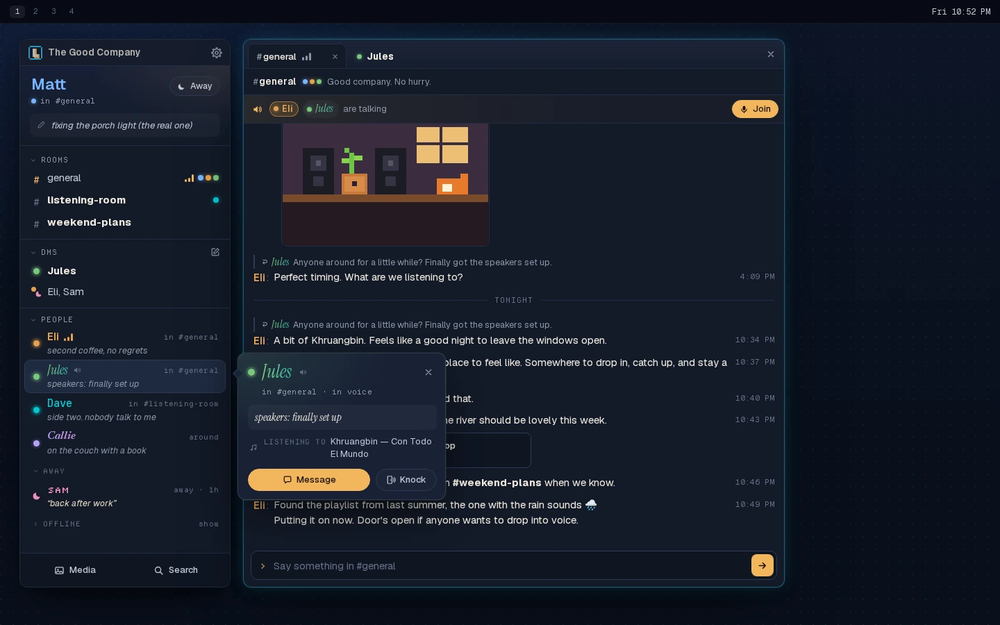

**Click someone (or press Enter) and their card opens beside the list:**

- the status in full, in their own face;
- what they're listening to, reading or working on;
- where they are.

The card has two clear buttons: **Message** and **Knock**. A knock makes their
row wiggle, and the button says "knocked" for three seconds. Offline people
can't be knocked. Hovering a row still shows the small Knock and Message
buttons, and a double-click still goes straight to a DM, the old AIM habit.

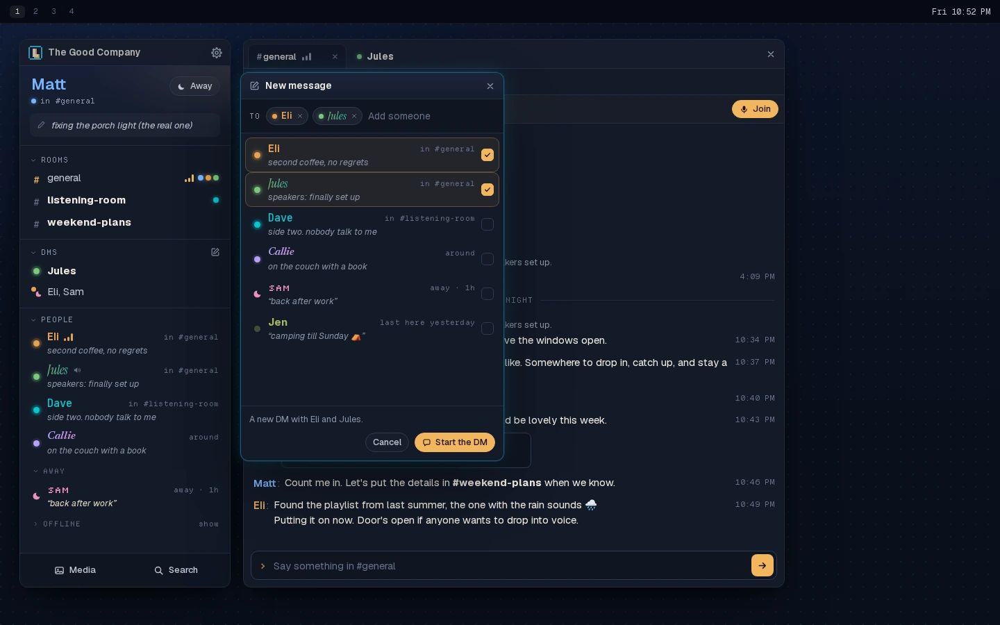

**New message.** The button on the DMs heading opens a small picker:

- **Choosing:** pick one person, or up to seven for a group, since a DM holds
  two to eight people, you included. There's a search field, and each person
  has their dot, styled name and status.
- **The same people twice** opens the same DM (SPEC §4.13), and the picker says
  so before you confirm.
- **A new set of people** makes a new DM.
- **Keyboard:** Enter picks the first match, and Backspace removes the last
  person you picked.

**Arrivals** show as small cards at the corner of the screen, like AIM's door
sounds. A very quiet door chime can go with them. Both are switches in
Settings: the cards are on and the chime is off to start.

| The away message | The list alone at the edge of the screen |
|---|---|
| 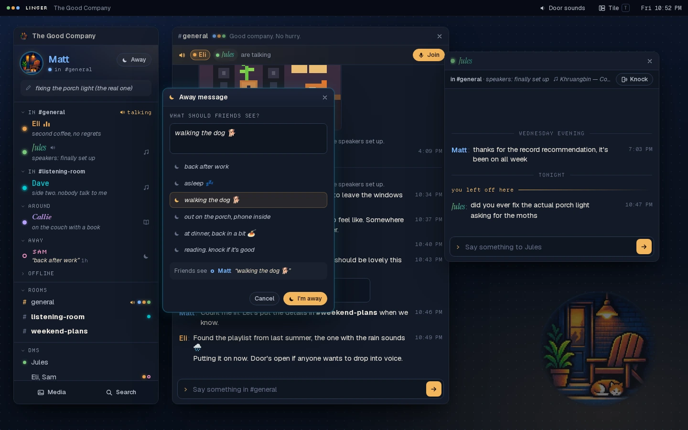 | 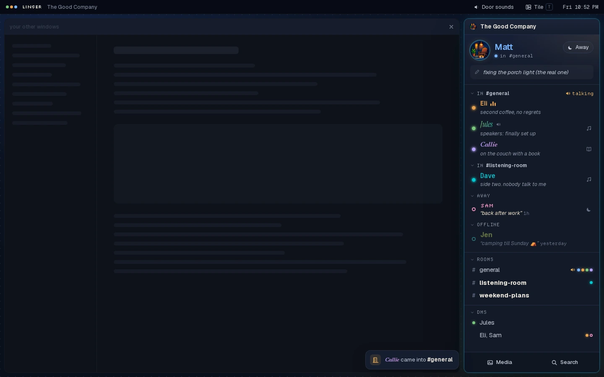 |

## Conversations: tabs or windows

A setting in Settings → Windows chooses how conversations open: **As tabs in
one window** (the default) or **Each in its own window**. Switching moves
whatever is open straight away.

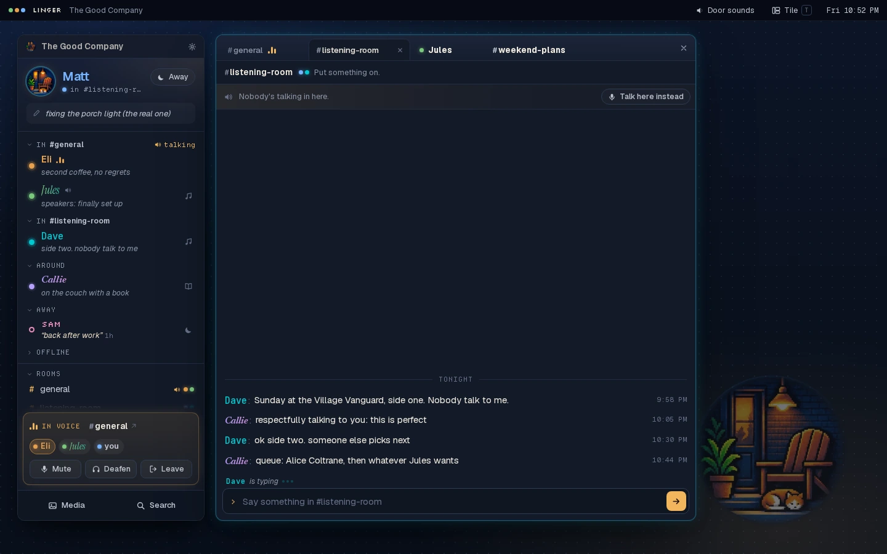

- The chat window's title bar is a row of tabs, like a browser. Opening a room
  or DM adds a tab, or shows it if it's already open.
- A tab goes bold when something new arrives in it, with no number.
- Tabs can be dragged to reorder them. Drag one off the row, or use its pop-out
  button, and it becomes its own window with **Back to tabs**.
- The desktop app would use Ctrl+Tab and Ctrl+W. The prototype uses Alt+←/→
  and Alt+W, because a browser keeps the Ctrl keys for itself.

**Windows** suit a tiling desktop like Omarchy: each conversation is a real
window, and Hyprland lays them out by itself. The prototype's **Tile** control
(or the T key) previews that.

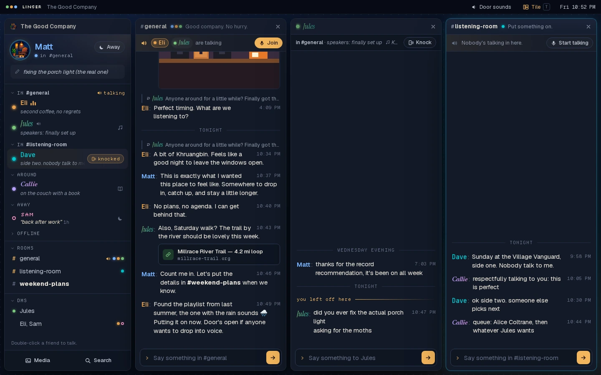

Conversations are compact either way. Names sit inline (`Eli: A bit of
Khruangbin…`), which suits smaller windows.

## Voice belongs to the room, not the tab or window

- **You stay in voice.** If you're in voice in #general, you can read
  #listening-room, close #general's tab, or close the whole chat window, and
  you stay in voice.
- **Only Leave, or moving voice to another room, ends it.** You are in voice in
  one room at a time, across every server.
- **Mute, Deafen and Leave live in one place:** a voice bar at the bottom of the
  buddy list, which is always open.
- **The tab of your voice room** shows moving sound bars.
- **Other rooms offer "Move voice here"** (or "Talk here instead" when they're
  quiet), so moving is never mistaken for a fresh join.

Today's app already keeps you in voice while you read another room (SPEC §5.6);
Matt confirmed it in the real app. The design keeps that rule.

## Settings

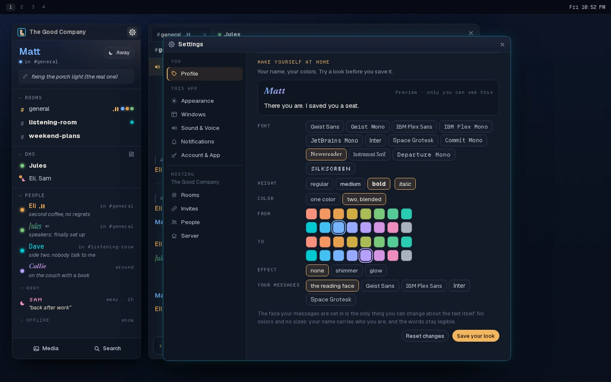

Settings is its own window, opened from the gear at the top of the list or
with Ctrl+,. A sidebar splits it into sections. **Settings must cover
everything today's app has.** This is today's settings panel and host panel,
regrouped, plus the new choices this design needs:

- **Profile:**
  - **Who you are:** display name and username.
  - **Your status:** status line, reading, listening to, working on, status
    image, and away message.
  - **Make yourself at home:** your name's font, weight, italic, one color or
    two blended, effect, and your message font, with a live preview. Saving
    changes your name in the list and in every conversation.
- **Appearance:**
  - color theme (dark, light, or follow the system);
  - interface size, with a preview;
  - evening warmth;
  - use plain names and message fonts (this one works in the prototype).
- **Windows** (new): conversations open as tabs or windows (this works), and
  what closing the list does: keep Linger running in the tray, or quit.
- **Sound & Voice:**
  - mute all notification sounds;
  - quiet hours, from and until in half-hour steps;
  - each chime with a Play preview: voice, mute and deafen, DMs, room
    messages, knocks;
  - **arrival cards** and **door sounds** (new);
  - microphone, speakers, and push to talk with its key.
- **Notifications:** desktop banners for mentions, plus "always notify me when
  this person posts", everywhere or in chosen rooms.
- **Account & App:** password, take everything with you (the export), updates,
  and signing out.
- **Servers** (with several servers): for each server, who you are there,
  Quiet, Own window, its place in the order, and signing out of it. Also Add a
  server.
- **Hosting** (for the host, with the server's name under the label):
  - **Rooms:** make a room, and change the order, names and topics, or archive
    one.
  - **Invites:** good for one person, five people or anyone; expiring after a
    day, a week or never; plus the links you've made.
  - **People:** members, removing someone, and letting someone back in.
  - **Server:** its name and its accent color.

Two things changed on purpose from today's wording. The host's room list, once
"The Rail", is now "Your rooms, in order", because there is no rail. Desktop
notifications have a section of their own instead of sitting under Sound &
Voice.

## Several servers

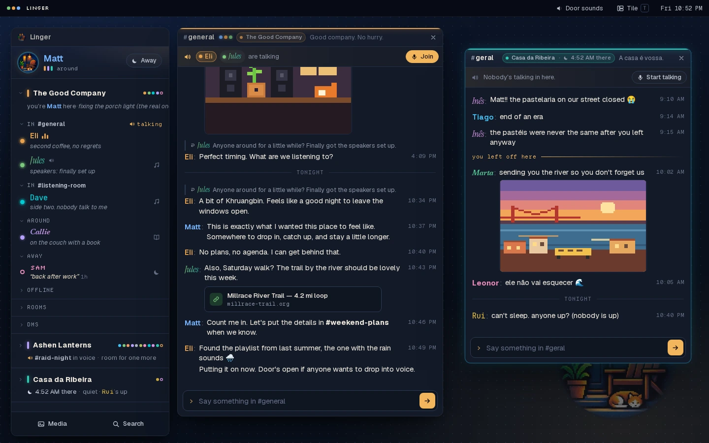

- **One list, each server a section,** like AIM's buddy groups. Inside each
  are its rooms, DMs and people, in the order above. You choose the order of
  the servers, and it never reshuffles by activity. A long server's header
  stays pinned while you scroll through it.
- **A folded server still shows its lights.** The header carries:
  - the server's color;
  - its name, bold when something inside is new;
  - the dots of who's on right now;
  - one plain line, like "#raid-night in voice · room for one more" or
    "☾ 4:52 AM there · quiet · Rui's up".

  There are no numbers.
- **Far-away servers show the time there.** The host sets the server's time
  zone once, so it isn't anyone's personal location.
- **A different you on each server.** Each server is its own account, because
  Linger has no account that spans servers. You might be Matt at home and
  Lamplighter in the guild, styled differently, with a status per server.
  - The top card keeps only what's true everywhere: you, and Away.
  - A friend on two of your servers appears twice, not linked, on purpose.
- **Away goes everywhere, with a choice.** The away editor has a checkbox per
  server.
- **Each server has a small menu,** and the same choices are in Settings →
  Servers:
  - **Quiet:** no chimes, no bold and no arrival cards for that server. Knocks
    still get through.
  - **Own window:** the server pops out into its own list.
- **Every conversation says where it's from.** A stripe in the server's color
  and a server tag mean two rooms called #general can't be confused.

| Raid night: the guild in its own list, tiled | Most days: every server folded |
|---|---|
| 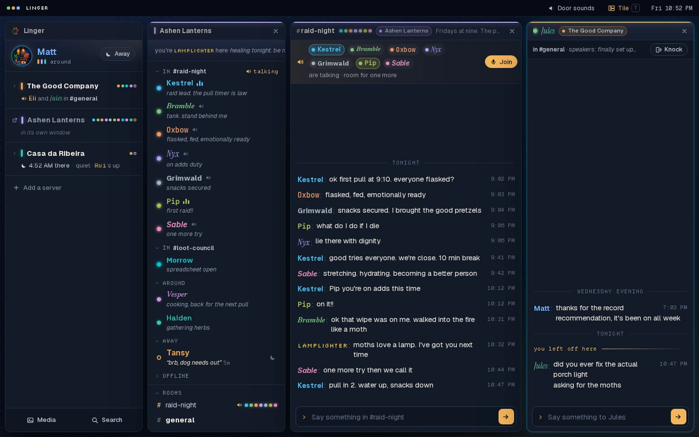 | 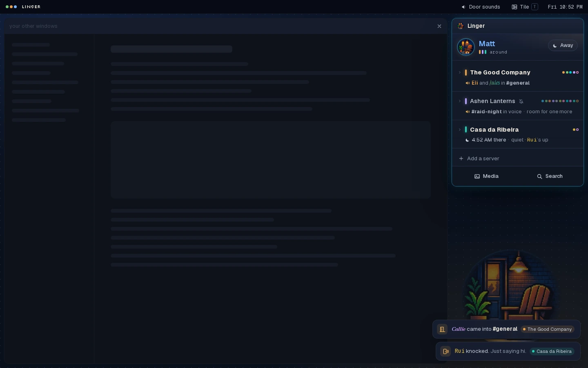 |

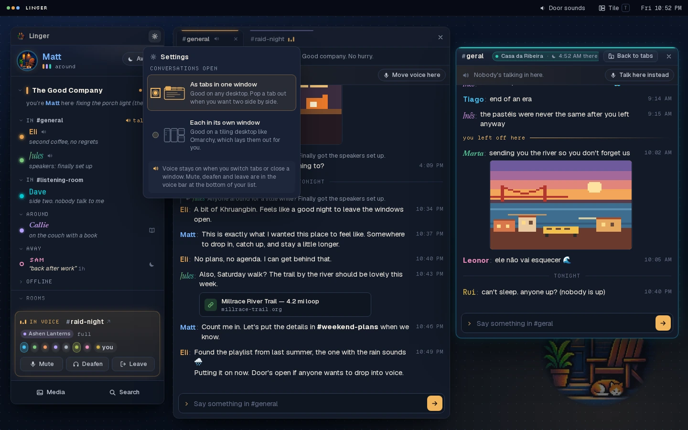

## Rules it changes

Building it means rewriting SPEC §5 and parts of §3 in the same change. It
breaks these current rules:

- **Surfaces** are night blue instead of cool gray (§5.3).
- **Windows and panels** get rounded corners and soft shadows (§5.1).
- **The three-column layout** gives way to a list plus conversation windows
  (§3).
- **Names sit inline** before the text, not above it (§4.7).
- **Labels** use pixel-style faces (§5.2).

The principles don't change:

- no counts or badges;
- new activity shows as weight only;
- nothing about which apps anyone has open;
- no AI, no telemetry;
- no avatars;
- the same vocabulary.

## What building it would take

- **A small real slice first,** per #101's method: the list, one room as a tab,
  the message box and the voice bar. Use it for a while before spreading it.
- **Real windows.** Tauri can open several windows, but the connection to the
  server has to live in one place and feed all of them.
- **Title bars.** Linger draws its own in every window, with the system still
  moving, snapping and tiling.
- **Voice keeps running** with its room's tab or window closed.
- **Window positions and open tabs are remembered.** What closing the list does
  follows the setting in Settings → Windows.
- **Every setting today's app has** comes across, as listed under Settings.
- **The contrast test** needs the new backgrounds added, so all 16 name colors
  still pass on them.

## Open questions

- **The small logo.** The mark beside the server name is a placeholder. Matt
  didn't like the options tried (2026-09-25), and the small logo gets
  redesigned later.
- **Closing the list.** Should it keep Linger running in the tray by default,
  as the prototype does, or quit?
- **New DMs.** A new DM only turns its row bold. AIM popped a window open, which
  is the kind of obligation Linger avoids, but some people will miss it.
- **Many rooms.** The narrow list suits three to six rooms per server, not
  fifteen.
- **Big groups.** Voice rooms above eight people and servers of 50–60 are a
  separate piece of work, tracked in #197.
