# The Buddy list design

**Status: built, and the app from 0.4.0.** Matt picked this design on
2026-09-25, and it was built the same week as M15 (#198) in
`client/src/next/`. `system.md` is how it's built; this page is what it is and
why.

It came out of #101's design exploration. Seven other directions were tried and
dropped. The prototype it started from is on the `design/buddy-list` branch.

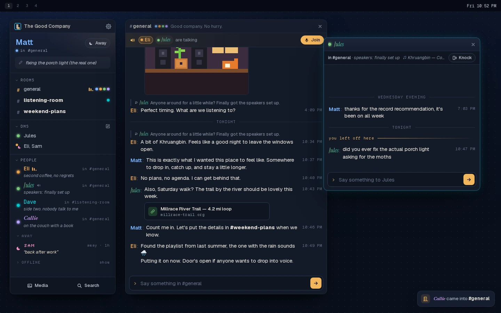

## Agreed on 2026-09-25

- **Keep the prototype's look and feel exactly:** the colors, type and spacing,
  and how fast and snappy it feels.
- **The buddy list is the app.** It is Linger's own window, not a page in a
  browser. Conversations open beside it in the same window (#337, below), or
  each in a real window of its own.
- **Linger draws its own title bars in every window,** so the look is the same
  everywhere. The operating system still moves, snaps, resizes and tiles them.
- **Tabs are the default everywhere, Hyprland included.** ~~The first room you
  open gets a chat window, which Hyprland tiles beside your list.~~ Since
  2026-09-30 (#337) the rooms you open are tabs beside the list, in the list's
  own window. Any tab can be popped out into its own window. "Each in its own
  window" is a setting you turn on.
- **Linux and Windows first.** No Mac version for now.
- **No avatars.** Nobody has a picture, you included. Identity is the styled
  name and the colored dot.

## Decided on 2026-09-25, from what was built

- **Names on their own line, once per run** (decision 9, changed on
  2026-09-28 by #295). A run of messages starts with the name on a line of its
  own, with no colon, and every message's words sit 16px in from it, so all of
  them start on one edge whoever wrote them. A reply starts a new run, with the
  message it answers quoted just above the name.
- **Away everywhere** (decision 14). The one Away button sets you away on every
  server you tick. A server that refuses or is offline says why under its own
  name, and the others still go away.
- **Signing in lives in the list window** (decision 16). Signed in nowhere, the
  list opens on the paste box. "Add a server", in Settings → Servers (or next
  to Sign out with one server), shows the same screen there, with a way back,
  and every other server stays connected.
- **Media and Search open in windows of their own** (decision 15), from the
  foot of the list, as in the prototype. A search hit or a media tile opens
  its conversation at that message. **Since 2026-09-30 (#337)** they open as
  tabs beside the list, like a conversation, and in windows of their own
  only when everything does; either can pop out and come back.
- **A server's color is its host's accent** (decision 18), the same for
  everybody. Each person's own color is their name's, chosen per server in
  Profile. A newcomer starts on the color the fewest people there wear, so a
  big server isn't a room of gray names. The palette stays at 16 colors;
  gradients and fonts are what keep sixty people apart, so Profile should
  make them easy to find.

## Decided on 2026-09-26

- **Push-to-talk** gets a key picker in Settings → Sound & Voice, Right Ctrl by
  default, so the Ctrl shortcuts never open the microphone. Open mic stays the
  default (decision 6).
- **Who's talking**: the voice bar's chip lights in the lamp and the speaker
  beside a name moves, as built (decision 7).
- **Drafts** are kept per conversation, across closing a tab and restarts
  (decision 11). **Clicking a banner** opens its conversation at the message
  (decision 20).
- **Dark only** for now (decision 2). **Message fading** stays (decision 10);
  the 80ch line width went in #334, and a message's words now run to its time
  column. **Window sizes** stay as built (decision 19).
- **Empty places** get one quiet sentence each (decision 17).
- **Arrival cards** ("Callie came into #general") are on by default and quiet:
  they never take focus, and stay silent in quiet hours and on a Quiet server
  (decision 13). The **door chime** is the first step toward personal entrance
  sounds: one shared chime, off by default, at most once per 5 minutes per
  listener (decision 12).
- **Many rooms**: past eight, rooms with nobody in them and nothing new fold
  under "More rooms", in the host's order, with no number (decision 22).
- **"4:52 AM there"** is skipped for now (decision 3).
- **The old gaps get fixed** (decision 21): a Pin action; a slow server no
  longer holds up the others at startup; and **being in a DM shows as
  "around" to everybody**, its own people included. Nobody sees that you're
  DMing, let alone with whom.

## The idea

Friends don't need Discord's four columns; they need a buddy list. The
spec already calls name styling "the AIM feature" and the status "the AIM away
message". This goes all the way: the main window is a tall list of your
friends, and conversations open beside it.

It fits either way of working. Keep it minimal, with one slim list at the edge
of the screen, or fill the screen with rooms side by side.

## The prototype

The clickable prototype (plain HTML and JavaScript, no server) lives on the
`design/buddy-list` branch under `client/prototypes/buddy-list/`, with its
switches (`?tabs`, `?servers`, `?still`) described there. The real client
replaced it on `main`; the screenshots on this page are from it.

## The look

It takes its colors from the logo, a lamp-lit porch at night:

- **Surfaces:** night blue.
- **Lamp amber:** for the few things that matter, such as the primary action
  and "you left off here".
- **Cyan:** a faint outline on the focused window, like the logo's sign.
- **Labels:** Departure Mono.
- **Message text:** always a plain sans.

People show a marker in their own palette color, next to their name in its
own styling. There's one marker per state, all the same size:

- **here:** a solid dot;
- **idle:** 💤, in their color (#259);
- **away:** a small crescent moon;
- **offline:** the dot, dimmed. In the list their name loses its color too:
  a dim grey in their own face, with no gradient, glow or shimmer, until
  they're back (#274).

The words ("away", "last here yesterday") are in the row and in tooltips and
screen-reader labels, so nothing relies on the shape or the color alone.

Every row in the list shares one marker column: a room's `#`, a DM's people,
a person's marker. So names line up down the whole list. A group DM's people
share that column too, arranged inside it. Rows have a fixed line height, so a
name set in a big serif or a small pixel face never changes the spacing.

**The small mark** is the porch door with the light on
(`assets/logo/linger-door.svg`, chosen 2026-09-25): an arched door in the
sign's cyan, its window lit amber, and the lamp-lit step under it. The porch
picture can't be read at the 16–20px the mark gets; its door can. The title
bar draws it from tokens (`app/LogoMark.tsx`), and the tray icon is the same
drawing (`src-tauri/icons/tray.png`). Four earlier pixel-drawn tries (a pixel
"L", the logo's three dots, the lamp, the word) were turned down. The app
icon is still the porch picture the friend group chose.

## The buddy list

From top to bottom, for each server:

1. **You:** your styled name, where you are, your status (click to edit), and an
   **Away** button. It opens an AIM-style away-message editor with saved
   presets. There is no picture. Click your name to see your own card (below).
2. **Rooms,** right under you, because they're where the activity shows:
   - the room's name, bold when something new arrives (weight only, no number);
   - the dots of who's in it;
   - moving sound bars while voice is on.

   Click a room to open it.
3. **DMs,** with a **new message** button on the heading (see below). A DM with
   something new goes bold and goes first; after those, the one somebody wrote
   in most recently, you or them, is on top (#248).
4. **People:** everyone on the server in one list, not grouped by room, since
   the rooms above already show who's where.
   - People who are here come first, whether they're in a room or around.
   - Then **Away**, with their away messages. In this design they're the stars.
   - Then **Offline**. Away and Offline have the same small heading with a
     caret: Away starts open, and Offline starts folded with "show". There are
     no counts anywhere.

   Each row has their dot, their styled name, one line of status or away
   message, and a faint note on the right: "in #general", "around" or "last
   here yesterday". An offline person's name is a dim grey rather than their
   colors, so the Offline group reads as nobody home.
5. **Media and Search** at the bottom.

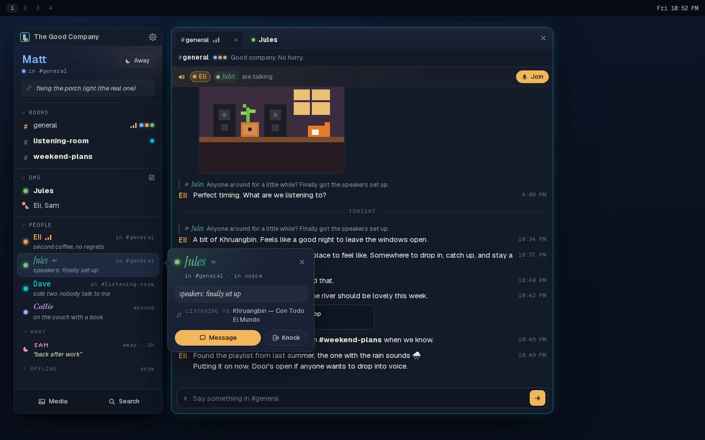

**Click someone (or press Enter) and their card opens beside the list:**

- the status in full, in their own face;
- their fields: what they're listening to, reading, playing, or anything
  they labelled themselves, with web addresses as links (#270);
- where they are.

The card has two clear buttons: **Message** and **Knock**. A knock makes their
row wiggle, and the button says "knocked" for three seconds. Offline people
can't be knocked. Hovering a row still shows the small Knock and Message
buttons, and a double-click still goes straight to a DM, the old AIM habit.

**Your own name opens your own card** (#271), at the top of the list and on
your messages in a conversation. It is the same card friends see, not a
look-alike, so it can't drift from what they see: your presence and where you
are, your status or away message, and your fields, following plain names like
everyone's. A quiet line at the top says "This is how friends see you", and
**Edit profile** (Settings → Profile) takes the place of Message and Knock.

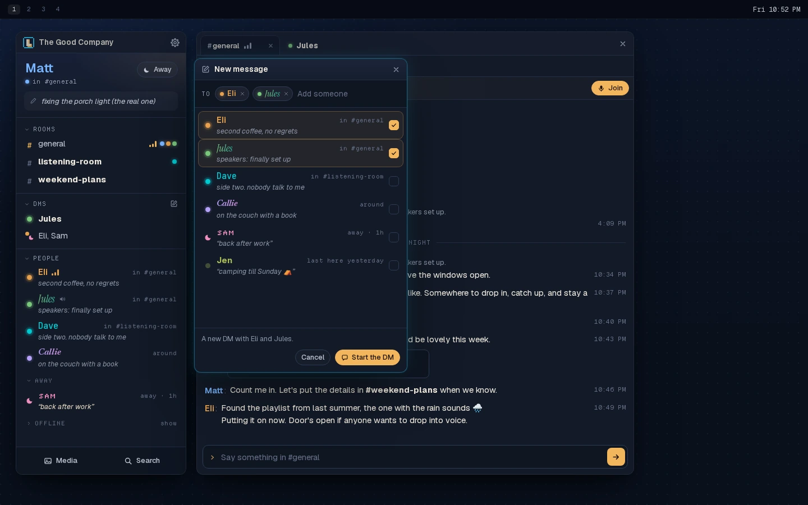

**New message.** The button on the DMs heading opens a small picker:

- **Choosing:** pick one person, or up to seven for a group, since a DM holds
  two to eight people, you included. There's a search field, and each person
  has their dot, styled name and status.
- **The same people twice** opens the same DM (SPEC §4.13), and the picker says
  so before you confirm.
- **A new set of people** makes a new DM.
- **Keyboard:** Enter picks the first match, and Backspace removes the last
  person you picked.

**Arrivals** show as small cards at the corner of the screen, like AIM's door
sounds. A very quiet door chime can go with them. Both are switches in
Settings: the cards are on and the chime is off to start.

| The away message | The list alone at the edge of the screen |
|---|---|
| 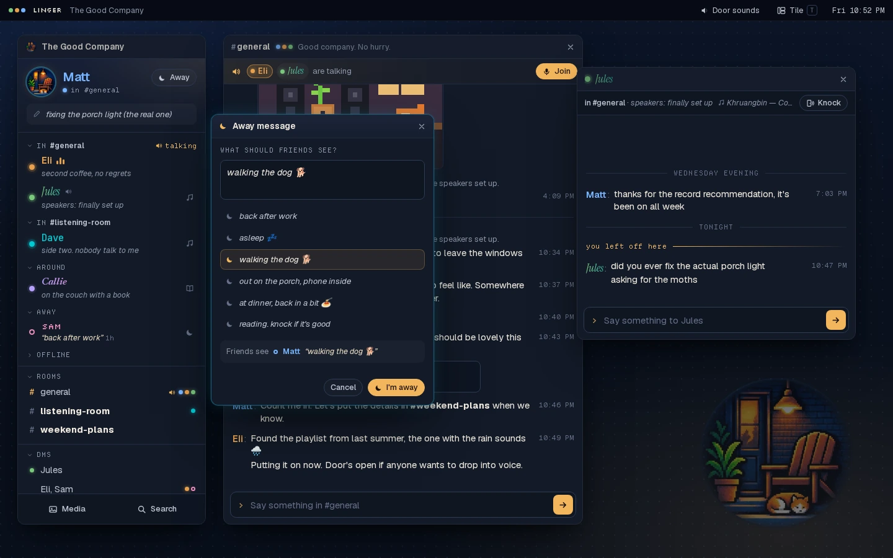 | 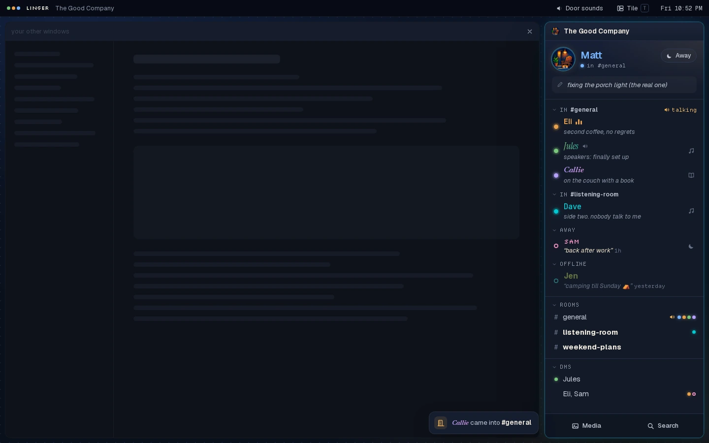 |

## Conversations beside the list

**Decided (Matt, 2026-09-30, #337):** the list is the one core window, and
conversations unfold out of it. It began as a friend's ask (dock the chat
window to the list so they move as one) and became the design: one real
window moves, snaps, minimizes and tiles as one on every desktop, Wayland
included, and it looks nothing like Discord's fixed columns. It replaced the
separate chat window of tabs, which had been the default.

A setting in Settings → Windows chooses how conversations open: **Beside your
list, in one window** (the default) or **Each in its own window**. Switching
moves whatever is open straight away.

- **Opening a room or DM unfolds the window** to the right by the
  conversation's width (leftwards where its screen ends) and adds a tab, or
  shows it if it's already open. The list keeps its width. A maximized
  window, or one a tiling desktop sizes, keeps its size, and the
  conversations fit what they get.
- **The line between the list and the conversations drags** (Matt,
  2026-09-30): wider list, narrower conversations, the window the same size.
  The arrow keys move it too, and Enter or a double press puts it back to
  340. The width is kept, and it's the width folding goes back to. The list
  goes 300–560 wide and the conversations keep at least 420; a narrower
  window squeezes the list before it gives the conversation the window.
- **The fold button (◧) is at the conversations' left edge**, in their title
  bar. It folds the window back to just the list and keeps the tabs; folding
  takes that button away, so a second click can't land on the list's close
  button. Folded with tabs kept, the list's title bar has a button beside the
  gear that brings them back: a neutral one, not the lamp (Matt, 2026-09-30:
  amber read as a notification, since it's what a DM nobody has read is lit
  in). Closing the last tab folds it too.
- **Too narrow for both** (a narrow tile, a small screen), the conversation
  takes the window, and ◧ goes back to the list.
- **One title bar across the window:** the list's (mark, name, gear) over the
  list, the tabs over the conversation, pop-out and close at the far right.
  A press anywhere on either moves the window.
- A tab goes bold when something new arrives in it, with no number.
- Tabs can be dragged to reorder them. The pop-out button makes the showing
  tab a window of its own, with **Back beside your list**.
- Ctrl+Tab, Ctrl+W and the rest move between tabs and close them.
- Each is kept on this computer: the tabs, whether it was folded, and how
  wide the list and the conversations were, so each comes back as it was.

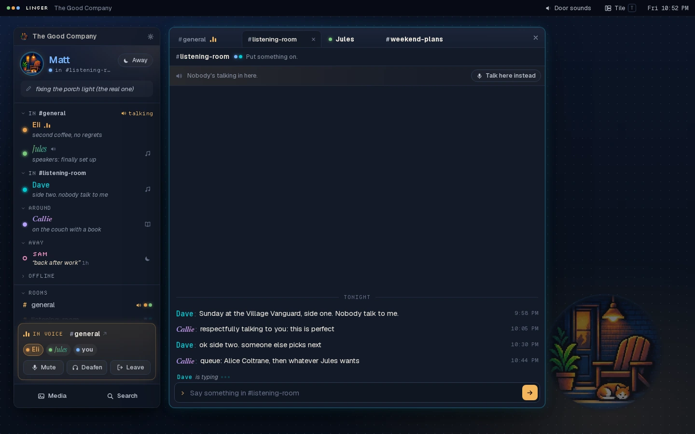

**Windows** suit a tiling desktop like Omarchy: each conversation is a real
window, and Hyprland lays them out by itself. The prototype's **Tile** control
(or the T key) previews that. With conversations beside the list, Hyprland
tiles the one window, which fills its tile.

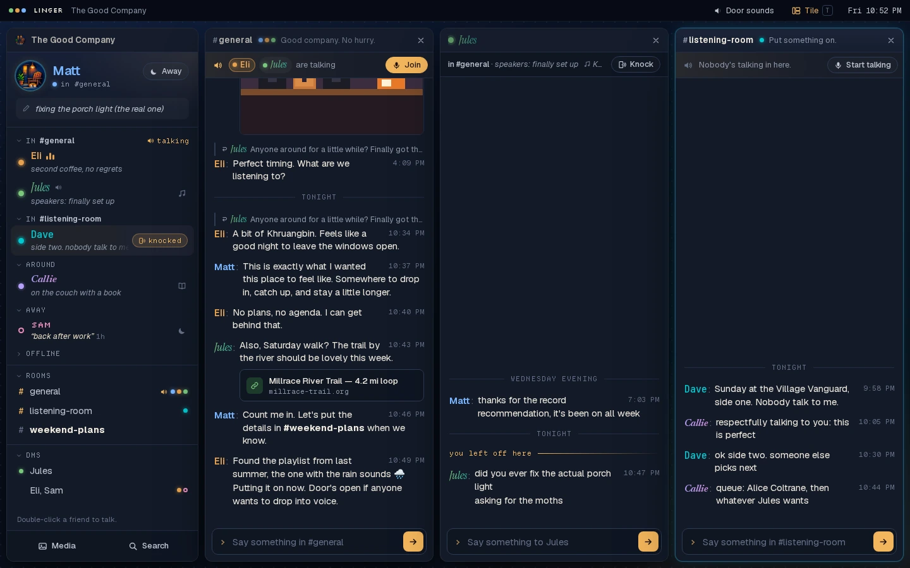

Conversations are compact either way. Names sit inline (`Eli: A bit of
Khruangbin…`), which suits smaller windows.

## Voice belongs to the room, not the tab or window

- **You stay in voice.** If you're in voice in #general, you can read
  #listening-room, close #general's tab, fold the conversations away or close
  a conversation's own window, and you stay in voice.
- **Only Leave, or moving voice to another room, ends it.** You are in voice in
  one room at a time, across every server.
- **Mute, Deafen and Leave live in one place:** a voice bar at the bottom of the
  buddy list, which is always open.
- **The tab of your voice room** shows moving sound bars.
- **Other rooms offer "Move voice here"** (or "Talk here instead" when they're
  quiet), so moving is never mistaken for a fresh join.

Today's app already keeps you in voice while you read another room (SPEC §5.6);
Matt confirmed it in the real app. The design keeps that rule.

## Settings

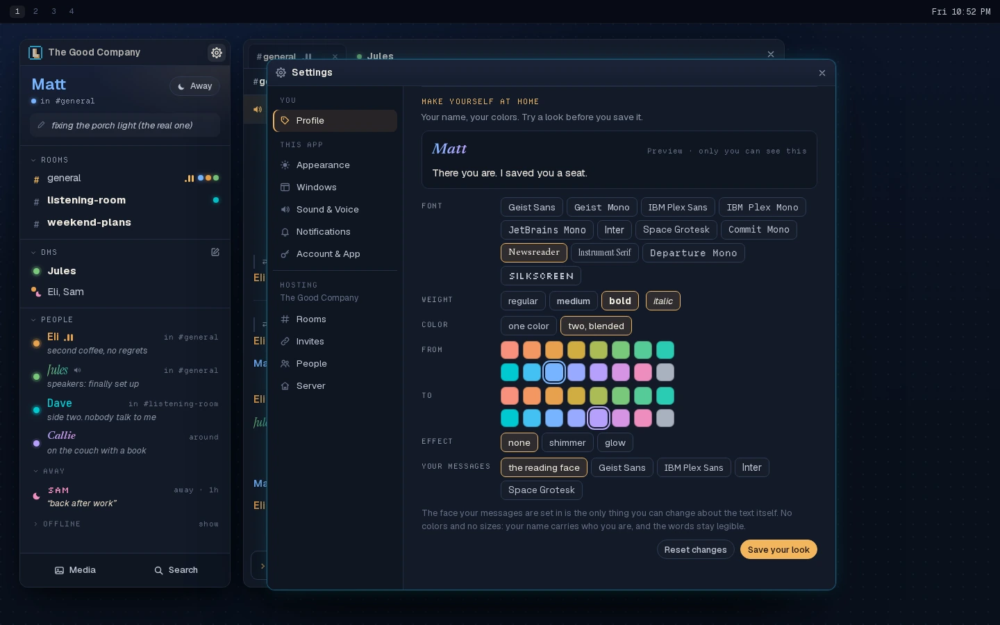

Settings is its own window, opened from the gear at the top of the list or
with Ctrl+,. A sidebar splits it into sections. **Settings must cover
everything today's app has.** This is today's settings panel and host panel,
regrouped, plus the new choices this design needs:

- **Profile:**
  - **Who you are:** display name and username.
  - **Your status:** status line, up to three fields (each a label picked
    from a list or typed, and a value; #270), and away message. There is no
    status picture (#269).
  - **Make yourself at home:** your name's font, weight, italic, one color or
    two blended, effect, and your message font, with a live preview. Saving
    changes your name in the list and in every conversation.
- **Appearance:**
  - color theme (dark, light, or follow the system);
  - interface size, with a preview;
  - evening warmth;
  - use plain names and message fonts (this one works in the prototype).
- **Windows** (new): conversations open as tabs or windows (this works), and
  what closing the list does: keep Linger running in the tray, or quit.
- **Sound & Voice:**
  - one sound volume for all of Linger's own sounds, from silent to 400%
    (#234);
  - mute all notification sounds;
  - quiet hours, from and until in half-hour steps;
  - each chime with a Play preview: voice, mute and deafen, DMs, room
    messages, knocks;
  - **arrival cards** and **door sounds** (new);
  - microphone, speakers, and push to talk with its key.
- **Notifications:** desktop banners for mentions, plus "always notify me when
  this person posts", everywhere or in chosen rooms.
- **Account & App:** password, take everything with you (the export), updates,
  starting Linger when you sign in to the computer (new, #228, off unless
  turned on), and signing out.
- **Servers** (with several servers): for each server, who you are there,
  Quiet, Own window, its place in the order, and signing out of it. Also Add a
  server.
- **Hosting** (for the host, with the server's name under the label):
  - **Rooms:** make a room, and change the order, names and topics, or archive
    one.
  - **Invites:** good for one person, five people or anyone; expiring after a
    day, a week or never; plus the links you've made.
  - **People:** members, removing someone, and letting someone back in.
  - **Server:** its name and its accent color.

Two things changed on purpose from today's wording. The host's room list, once
"The Rail", is now "Your rooms, in order", because there is no rail. Desktop
notifications have a section of their own instead of sitting under Sound &
Voice.

## Several servers

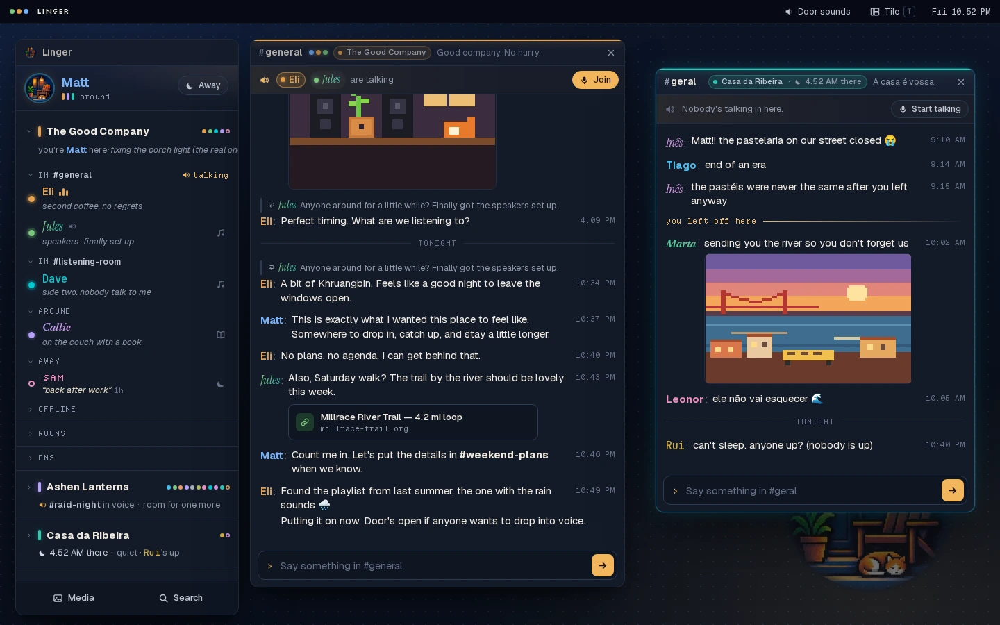

- **One list, each server a section,** like AIM's buddy groups. Inside each
  are its rooms, DMs and people, in the order above. You choose the order of
  the servers, and it never reshuffles by activity. A long server's header
  stays pinned while you scroll through it.
- **A folded server still shows its lights.** The header carries:
  - the server's color;
  - its name, bold when something inside is new;
  - the dots of who's on right now;
  - one plain line, like "#raid-night in voice · room for one more" or
    "☾ 4:52 AM there · quiet · Rui's up".

  There are no numbers.
- **Far-away servers show the time there.** The host sets the server's time
  zone once, so it isn't anyone's personal location.
- **A different you on each server.** Each server is its own account, because
  Linger has no account that spans servers. You might be Matt at home and
  Lamplighter in the guild, styled differently, with a status per server.
  - The top card keeps only what's true everywhere: you, and Away.
  - A friend on two of your servers appears twice, not linked, on purpose.
- **Away goes everywhere, with a choice.** The away editor has a checkbox per
  server.
- **Each server has a small menu,** and the same choices are in Settings →
  Servers:
  - **Quiet:** no chimes, no bold and no arrival cards for that server. Knocks
    still get through.
  - **Own window:** the server pops out into its own list.
- **Every conversation says where it's from.** A stripe in the server's color
  and a server tag mean two rooms called #general can't be confused.

| Raid night: the guild in its own list, tiled | Most days: every server folded |
|---|---|
| 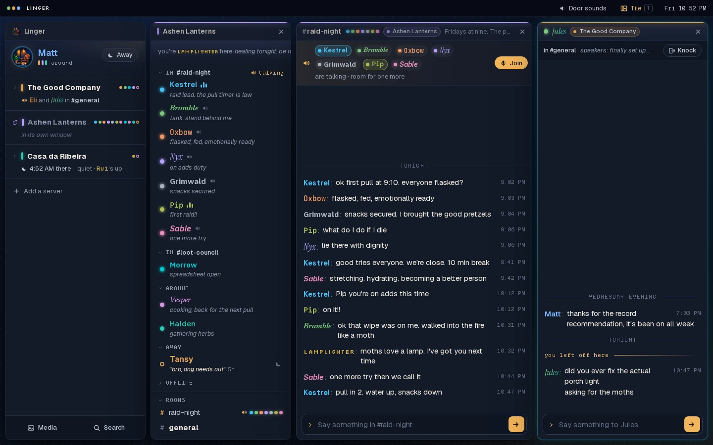 | 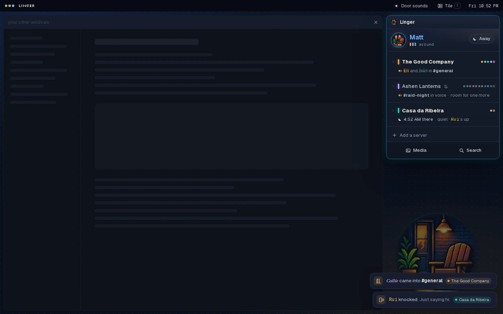 |

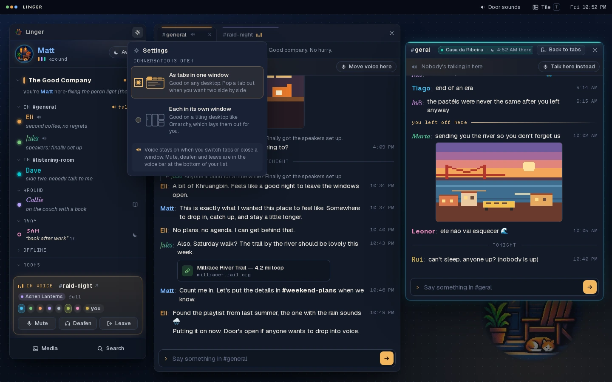

## Rules it changes

Building it means rewriting SPEC §5 and parts of §3 in the same change. It
breaks these current rules:

- **Surfaces** are night blue instead of cool gray (§5.3).
- **Windows and panels** get rounded corners and soft shadows (§5.1).
- **The three-column layout** gives way to a list plus conversation windows
  (§3).
- **Names sit inline** before the text, not above it (§4.7).
- **Labels** use pixel-style faces (§5.2).

The principles don't change:

- no counts or badges;
- new activity shows as weight only;
- nothing about which apps anyone has open;
- no telemetry;
- no avatars;
- the same vocabulary.

## What building it would take

- **A small real slice first,** per #101's method: the list, one room as a tab,
  the message box and the voice bar. Use it for a while before spreading it.
- **Real windows.** Tauri can open several windows, but the connection to the
  server has to live in one place and feed all of them.
- **Title bars.** Linger draws its own in every window, with the system still
  moving, snapping and tiling.
- **Voice keeps running** with its room's tab or window closed.
- **Window positions and open tabs are remembered.** What closing the list does
  follows the setting in Settings → Windows.
- **Every setting today's app has** comes across, as listed under Settings.
- **The contrast test** needs the new backgrounds added, so all 16 name colors
  still pass on them.

## Open questions

- **The small logo.** Now the lit door (above, 2026-09-25). Matt can still
  change it.
- **Closing the list.** Decided on 2026-09-25: it keeps Linger running in the
  tray, and Settings → Windows can make it quit instead.
- **New DMs.** A new DM only turns its row bold. AIM popped a window open, which
  is the kind of obligation Linger avoids, but some people will miss it.
- **Many rooms.** The narrow list suits three to six rooms per server, not
  fifteen.
- **Big groups.** Voice rooms hold 25, through the host's server. Bigger voice
  rooms, and servers of 50–60 or more, haven't been tried; that work is #197.
